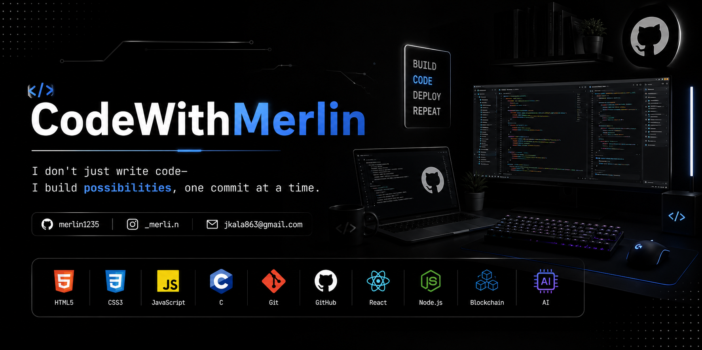

<h1 align="center">Hi 👋, I'm Joseph Musyimi Kala</h1>

<h3 align="center">
💻 Computer Science Student | Frontend Developer | Open Source Enthusiast
</h3>

  

  
  
  

---

# 🚀 About Me

- 🎓 Computer Science Student
- 💻 Frontend Developer
- 🌱 Currently learning **React.js, Node.js, Blockchain & Web3**
- 🤖 Exploring Artificial Intelligence
- ☁️ Learning Cloud Computing
- 🚀 Building real-world projects every day
- 🎯 Goal: Become a Full-Stack Software Engineer

---

# 🛠️ Tech Stack

---

---

## 🚀 Featured Projects

- 🌐 **Portfolio Website** – My personal portfolio showcasing my skills, projects, and journey as a developer.
- 🗄️ **SchemaLens** – A database schema visualization tool that helps developers understand and explore database structures.
- ⛓️ **Blockchain & Web3 Projects** – Hands-on projects exploring smart contracts, decentralized applications (dApps), and Web3 technologies.
- 🚀 **CodeWithMerlin** – My personal brand where I share programming tutorials, tech insights, and development resources.
- 💻 **JavaScript Projects** – A collection of interactive web applications built with HTML, CSS, and JavaScript.
- 🐍 **Python Projects** – Practical Python applications focused on automation, problem-solving, and learning.

---

---

# 🔥 GitHub Streak

---

# 📈 Contribution Graph

---

# 📚 Currently Learning

- ⚛️ React.js
- 🟢 Node.js
- 🔗 Blockchain & Web3
- 🤖 Artificial Intelligence
- ☁️ Cloud Computing

---

# 🌐 Connect With Me

📧 **Email:** jkala863@gmail.com

---

# 💡 Quote

> *"Code is not just syntax—it's a tool for solving real problems and creating meaningful impact."*

---

### ⭐ Thanks for visiting my profile!

If you enjoy my work, consider following me and starring my repositories.

🚀 **Happy Coding!**

